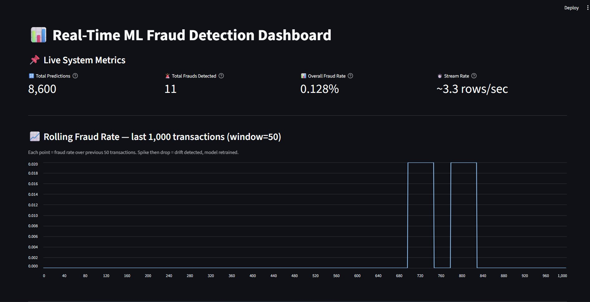
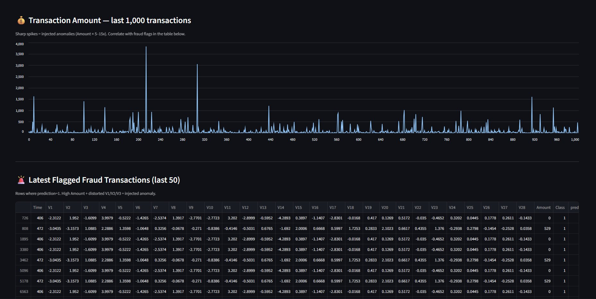

#  Self-Healing ML Fraud Detection System

A real-time machine learning pipeline that detects credit card fraud, monitors itself for model drift, and **automatically retrains** when its accuracy starts to degrade — without any human intervention.

---

##  The Real Problem This Solves

Every ML model deployed in production faces the same silent killer: **concept drift**.

When a bank trains a fraud detection model today, it learns patterns from *today's* fraud. But fraudsters adapt. They change their behaviour — new transaction patterns, new amounts, new timing. Within weeks or months, the model that was 95% accurate starts missing fraud it would have caught before.

**The traditional solution:** A data science team manually monitors dashboards, notices performance drops after days or weeks, retrains the model manually, redeploys it. During that window — real fraud slips through.

**What this system does instead:** It detects the moment data patterns start shifting and retrains itself automatically in the background, while predictions keep running without interruption. Zero downtime. Zero manual intervention.

---

## Real-World Applications

This architecture directly maps to problems faced by:

| Industry | Problem | How This Applies |
|----------|---------|-----------------|
| **Banking & Fintech** | Fraud patterns change as fraudsters adapt | Auto-retrain keeps detection current without analyst intervention |
| **E-commerce** | Purchase behaviour shifts seasonally | Model adapts to Black Friday patterns automatically |
| **Insurance** | Claim patterns drift after economic events | System detects distribution shift and updates risk scoring |
| **Cybersecurity** | Attack patterns evolve constantly | Anomaly detector retrains as new attack signatures emerge |
| **Healthcare** | Patient data distributions change across hospitals | Model self-adjusts when deployed to new environments |

Companies like **Stripe, PayPal, Mastercard** and **Visa** run systems built on exactly this principle — continuous learning pipelines that monitor themselves and adapt without human bottlenecks.

---

## Dashboard Screenshots

### Live Metrics & Rolling Fraud Rate

*Real-time metrics updating every 5 seconds. The rolling fraud rate chart shows fraud clustering — spikes indicate detected anomalies.*

### Transaction Amount Monitoring & Fraud Table

*Sharp spikes in the Amount chart are injected anomalies (5% of transactions get Amount × 5–15x). The fraud table shows the raw flagged rows with full feature visibility.*

---

##  System Architecture

```
fraud.csv (Kaggle dataset)
      │
      ▼
 train.py ──── runs once on setup
      │         trains RandomForest → model.pkl
      │
      ▼
 app.py ──── starts two parallel threads
      │
      ├── Thread 1: stream.py
      │       reads fraud.csv row by row (0.3s each)
      │       randomly distorts 5% of rows (simulated fraud)
      │       pushes rows into a bounded Queue
      │
      └── Thread 2: pipeline()
              pulls rows from Queue
                    │
                    ├── predict.py   → scores transaction (0=normal, 1=fraud)
                    ├── logger.py    → appends result to predictions.csv
                    └── monitor.py  → tracks feature distribution over time
                              │
                              └── drift detected?
                                        │
                                        ▼
                                   retrain.py (background thread)
                                        retrains on recent logs
                                        compares F1 score
                                        saves model only if improved

 dashboard.py ── separate Streamlit process
      reads predictions.csv every 5 seconds
      shows live metrics + charts
```

---

##  How the Self-Healing Works

### 1. Drift Detection (`monitor.py`)
Every transaction's feature vector is tracked. The system compares the mean of the oldest 25 observations against the newest 25 in a rolling 200-row window. When the difference exceeds a threshold, drift is flagged.

### 2. Background Retraining (`retrain.py`)
Retraining runs in a **separate thread** so predictions never pause. It trains on the most recent 5,000 logged transactions (falls back to the original dataset if logs are too short). Uses `class_weight="balanced"` to handle the extreme class imbalance in fraud data.

### 3. Model Gating
The new model is only saved if its **F1 score is equal to or better** than the current model. A bad retrain (caused by a noisy drift spike) is automatically discarded — the old model stays in production.

### 4. Hot Reload (`predict.py`)
After a successful retrain, the new model is pulled into memory immediately via `reload_model()`. No restart required.

---

## Getting Started

### Prerequisites
- Python 3.10+
- The [Credit Card Fraud Detection dataset](https://www.kaggle.com/datasets/mlg-ulb/creditcardfraud) from Kaggle

### Installation

```bash
# 1. Clone the repository
git clone https://github.com/yourusername/self-healing-ml.git
cd self-healing-ml

# 2. Create and activate virtual environment
python -m venv .venv
.venv\Scripts\activate        # Windows
source .venv/bin/activate     # Mac/Linux

# 3. Install dependencies
pip install -r requirements.txt
```

### Dataset Setup

Download `creditcard.csv` from [Kaggle](https://www.kaggle.com/datasets/mlg-ulb/creditcardfraud), rename it to `fraud.csv` and place it in the `data/` folder:

```
self-healing-ml/
└── data/
    └── fraud.csv    ← place here
```

### Running the System

```bash
# Step 1 — Train the initial model (run once)
python train.py

# Step 2 — Start the pipeline (Terminal 1)
uvicorn app:app --reload

# Step 3 — Start the dashboard (Terminal 2)
streamlit run dashboard.py
```

Open your browser at **http://localhost:8501**

---

##  Project Structure

```
self-healing-ml/
├── app.py              # FastAPI app + pipeline orchestration
├── train.py            # Initial model training
├── dashboard.py        # Streamlit monitoring dashboard
├── requirements.txt    # Pinned dependencies
├── data/
│   └── fraud.csv       # Dataset (download from Kaggle, not in repo)
├── models/
│   └── model.pkl       # Trained model (generated at runtime)
├── logs/
│   └── predictions.csv # Live prediction log (generated at runtime)
└── src/
    ├── stream.py        # Data streaming + anomaly injection
    ├── predict.py       # Model inference with hot reload
    ├── monitor.py       # Drift detection
    ├── retrain.py       # Background retraining with F1 gating
    └── logger.py        # Thread-safe CSV logging
```

---

##  Dashboard Explained

| Component | What It Shows |
|-----------|--------------|
| **Total Predictions** | Every transaction scored since pipeline started |
| **Total Frauds Detected** | Count of prediction=1 across all history |
| **Overall Fraud Rate** | Frauds ÷ Total (real-world baseline ~0.17%) |
| **Stream Rate** | Transactions processed per second |
| **Rolling Fraud Rate chart** | 50-transaction rolling average — reveals fraud clustering trends |
| **Transaction Amount chart** | Spikes = injected anomalies (Amount × 5–15x) |
| **Fraud Table** | Raw flagged rows — inspect V1/V2/V3 and Amount to verify detections |

---

## Tech Stack

| Layer | Technology |
|-------|-----------|
| API & Pipeline | FastAPI + Uvicorn |
| ML Model | scikit-learn RandomForestClassifier |
| Data Processing | pandas, numpy |
| Model Persistence | joblib |
| Dashboard | Streamlit + streamlit-autorefresh |
| Concurrency | Python threading + Queue |

---

## Dependencies

Install exact versions for reproducible results:

```bash
pip install -r requirements.txt
```

```
fastapi==0.115.0
uvicorn==0.30.6
streamlit==1.38.0
streamlit-autorefresh==1.0.1
scikit-learn==1.5.2
pandas==2.2.3
numpy==1.26.4
joblib==1.4.2
```

---

## Key Design Decisions

**Why RandomForest?**
Handles the extreme class imbalance in fraud data well (only 0.17% of transactions are fraud). `class_weight="balanced"` automatically adjusts for this without manual resampling.

**Why retrain on recent logs instead of full dataset?**
Drift means *recent* data has changed. Retraining on 284,000 historical rows would drown out the signal from the new pattern. The last 5,000 logged rows carry the most relevant signal for what fraud looks like right now.

**Why gate retraining with F1 score?**
A drift spike caused by a temporary anomaly batch could trigger a retrain on noisy data, producing a worse model. The F1 gate ensures production quality never degrades from an automatic retrain.

**Why a bounded Queue (maxsize=100)?**
Prevents the stream thread from running ahead of the pipeline and consuming unbounded memory if the pipeline slows down during retraining.


---

## Acknowledgements

- Dataset: [Credit Card Fraud Detection](https://www.kaggle.com/datasets/mlg-ulb/creditcardfraud) by ULB Machine Learning Group on Kaggle
- Built with scikit-learn, FastAPI, and Streamlit
